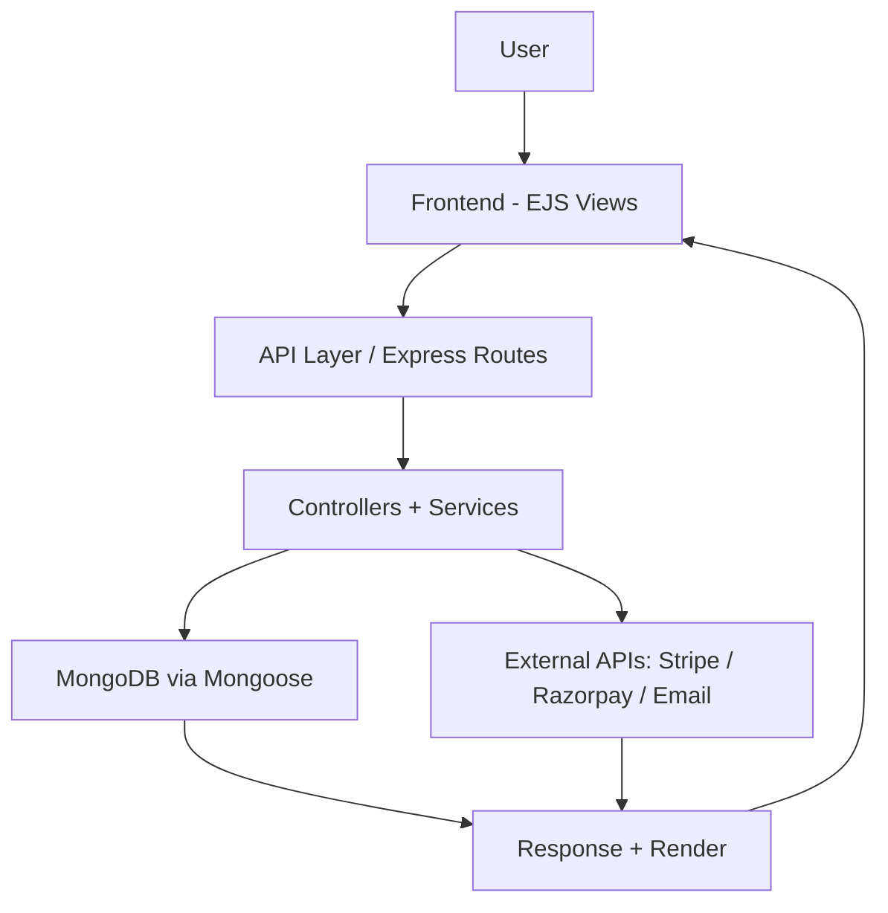
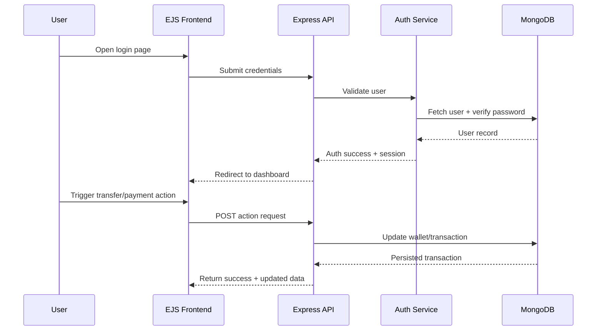
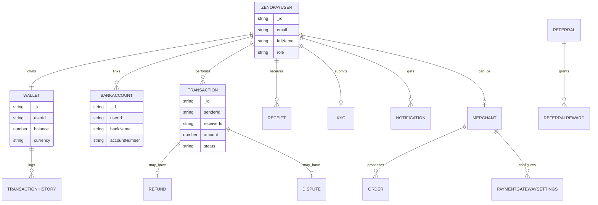

<div align="center">

# ZenoPay V2

### **_Smart digital payments, wallet operations, and merchant workflows in one platform._**

<p>
  
  
  
  
  
</p>

<p>
  <a href="https://github.com/yourusername/zenpay-V2/actions">
    
  </a>
  <a href="./LICENSE">
    
  </a>
  <a href="https://github.com/yourusername/zenpay-V2/commits/main">
    
  </a>
  <a href="https://github.com/yourusername/zenpay-V2/issues">
    
  </a>
  <a href="https://github.com/yourusername/zenpay-V2/stargazers">
    
  </a>
</p>

<p>
  <a href="https://your-live-demo-url.com"></a>
  <a href="https://github.com/yourusername/zenpay-V2/issues/new?labels=bug"></a>
  <a href="https://github.com/yourusername/zenpay-V2/issues/new?labels=enhancement"></a>
</p>

</div>

---

## 📌 Project Details

- **Project Name:** ZenoPay V2
- **Short Description:** A full-stack fintech platform for wallet management, transfers, merchant payments, KYC, receipts, and admin operations.
- **Tech Stack:** Node.js, Express, MongoDB (Mongoose), EJS, HTML/CSS/JS, Jest
- **Live Demo URL:** `https://your-live-demo-url.com` *(replace with actual URL)*
- **GitHub Repo URL:** `https://github.com/yourusername/zenpay-V2` *(replace with actual URL)*

---

## 📚 Table of Contents

- [📌 Project Details](#-project-details)
- [🧠 About the Project](#-about-the-project)
- [🛠️ Tech Stack](#️-tech-stack)
  - [Frontend](#frontend)
  - [Backend](#backend)
  - [Database](#database)
  - [Tools & DevOps](#tools--devops)
- [🧭 System Architecture / Workflow Diagram](#-system-architecture--workflow-diagram)
  - [Flowchart](#flowchart)
  - [Sequence Diagram](#sequence-diagram)
- [🗃️ Database Schema (ER Diagram)](#️-database-schema-er-diagram)
- [✨ Features](#-features)
- [👥 Contributors & Contribution Stats](#-contributors--contribution-stats)
  - [Contributors](#contributors)
  - [Contribution Graph](#contribution-graph)
  - [Commit Distribution](#commit-distribution)
  - [Who Built What](#who-built-what)
- [🚀 Getting Started](#-getting-started)
  - [Prerequisites](#prerequisites)
  - [Installation](#installation)
  - [Environment Variables](#environment-variables)
- [🗂️ Folder Structure](#️-folder-structure)
- [🛣️ Roadmap](#️-roadmap)
- [📜 License & Acknowledgements](#-license--acknowledgements)

---

## 🧠 About the Project

ZenoPay V2 solves the complexity of running modern payment operations by combining user wallets, merchant enablement, KYC, payout workflows, and an admin console into one cohesive system.

### Highlights

- 🔐 Multi-role authentication for **users, merchants, and admins**
- 💸 Wallet, transfer, request-money, and payment flows
- 🧾 Receipt, statement, and transaction history generation
- 🧪 Unit/integration/middleware testing setup with Jest + Supertest
- 🧩 Extensible architecture with feature-specific controllers and services
- 📦 Integrated support for payment providers (Stripe, Razorpay, PayPal)


---

## 🛠️ Tech Stack

### Frontend


### Backend


### Database


### Tools & DevOps


---

## 🧭 System Architecture / Workflow Diagram

### Flowchart



### Sequence Diagram



---

## 🗃️ Database Schema (ER Diagram)



---

## ✨ Features

| Feature | Added By | Status |
|---|---|---|
| User authentication & session management | @core-team | ✅ Done |
| Wallet management & transfers | @payments-team | ✅ Done |
| Merchant onboarding & routes | @merchant-team | ✅ Done |
| KYC workflow integration | @compliance-team | ✅ Done |
| Dispute & refund processing | @risk-team | 🚧 In Progress |
| Advanced analytics dashboard | @data-team | 🔜 Planned |

---

## 👥 Contributors & Contribution Stats

### Contributors

<table>
  <tr>
    <td align="center">
      <br/>
      <b>Name One</b><br/>
      <sub>🔧 87 commits | ⭐ Core Features</sub>
    </td>
    <td align="center">
      <br/>
      <b>Name Two</b><br/>
      <sub>🔧 52 commits | ⭐ Auth & Dashboard</sub>
    </td>
    <td align="center">
      <br/>
      <b>Name Three</b><br/>
      <sub>🔧 18 commits | ⭐ Payments & Integrations</sub>
    </td>
  </tr>
</table>

### Contribution Graph

[](https://github.com/yourusername/zenpay-V2/graphs/contributors)

### Commit Distribution

```text
Contributions by commit count:
[username1] ████████████████████ 87 commits
[username2] ████████████         52 commits
[username3] ████                 18 commits
```

### Who Built What

| Contributor | Unique Feature Added |
|---|---|
| @username1 | Payment Gateway Integration |
| @username2 | Auth System & Dashboard UI |
| @username3 | KYC Verification Flow |

---

## 🚀 Getting Started

### Prerequisites

- Node.js **v18+**
- npm **v9+**
- MongoDB local instance or MongoDB Atlas
- Git

### Installation

1. Clone the repository.

```bash
git clone https://github.com/yourusername/zenpay-V2.git
```

2. Move into the project directory.

```bash
cd zenpay-V2/ZenoPay
```

3. Install dependencies.

```bash
npm install
```

4. Create your environment file.

```bash
cp .env.example .env
```

5. Start the development server.

```bash
npm run start
```

6. Run tests.

```bash
npm test
```

### Environment Variables

| Variable | Description | Example |
|---|---|---|
| `NODE_ENV` | App environment mode | `development` |
| `PORT` | Server port | `3000` |
| `MONGO_URI` | MongoDB connection URI | `mongodb://localhost:27017/zenopay` |
| `SESSION_SECRET` | Session signing secret | `replace-with-long-random-secret` |
| `RAZORPAY_KEY` | Razorpay API key | `rzp_test_xxxxx` |
| `RAZORPAY_SECRET` | Razorpay secret | `xxxxxx` |
| `STRIPE_SECRET_KEY` | Stripe secret key | `sk_test_xxxxx` |
| `STRIPE_PUBLISHABLE_KEY` | Stripe publishable key | `pk_test_xxxxx` |
| `EMAIL_PROVIDER` | Email transport provider | `smtp` |
| `SMTP_HOST` | SMTP host | `smtp.gmail.com` |
| `SMTP_USER` | SMTP username/email | `your-email@gmail.com` |
| `SMTP_PASSWORD` | SMTP password/app key | `your-app-password` |
| `AZURE_STORAGE_CONNECTION_STRING` | Azure Blob storage connection | `DefaultEndpointsProtocol=...` |
| `JWT_SECRET` | JWT signing key | `replace-with-long-random-secret` |
| `TWILIO_ACCOUNT_SID` | Twilio account SID | `ACxxxxxxxx` |
| `TWILIO_AUTH_TOKEN` | Twilio auth token | `xxxxxxxx` |

---

## 🗂️ Folder Structure

```text
📁 ZenoPay/
├── 📁 Admin/
├── 📁 Controllers/
├── 📁 Merchant/
├── 📁 Middleware/
├── 📁 Models/
├── 📁 Routes/
├── 📁 Services/
├── 📁 config/
├── 📁 docs/
├── 📁 public/
├── 📁 scripts/
├── 📁 tests/
├── 📁 utils/
├── 📁 views/
├── 📄 app.js
├── 📄 package.json
└── 📄 jest.config.js
```

---

## 🛣️ Roadmap

- [x] User authentication and role-based access
- [x] Wallet and transaction management
- [x] Merchant onboarding modules
- [ ] Real-time transaction notifications (planned)
- [ ] Advanced analytics and BI dashboards (planned)
- [ ] Multi-currency intelligent settlements (planned)

---

## 📜 License & Acknowledgements

[](./LICENSE)

This project is built with the amazing open-source ecosystem around:

- Express.js
- MongoDB + Mongoose
- EJS
- Jest + Supertest
- Stripe / Razorpay / PayPal APIs
- Nodemailer / Twilio / Azure Blob Storage

---

<div align="center">

### Made with ❤️ by ZenoPay Team

</div>
