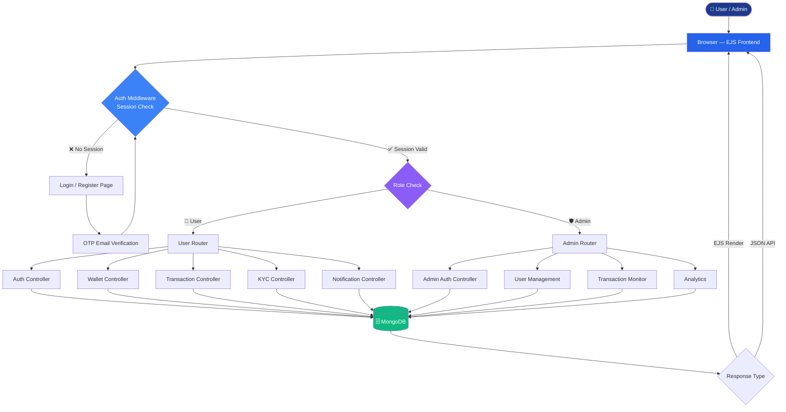
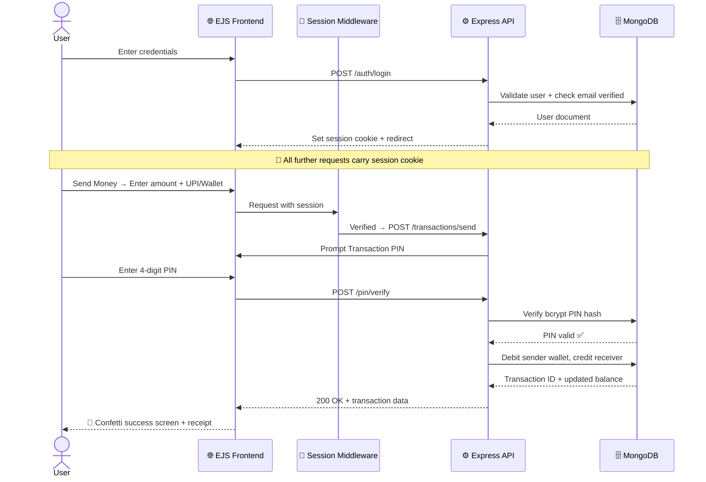
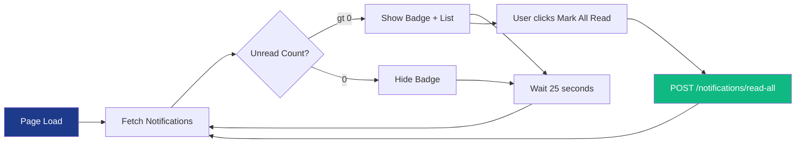
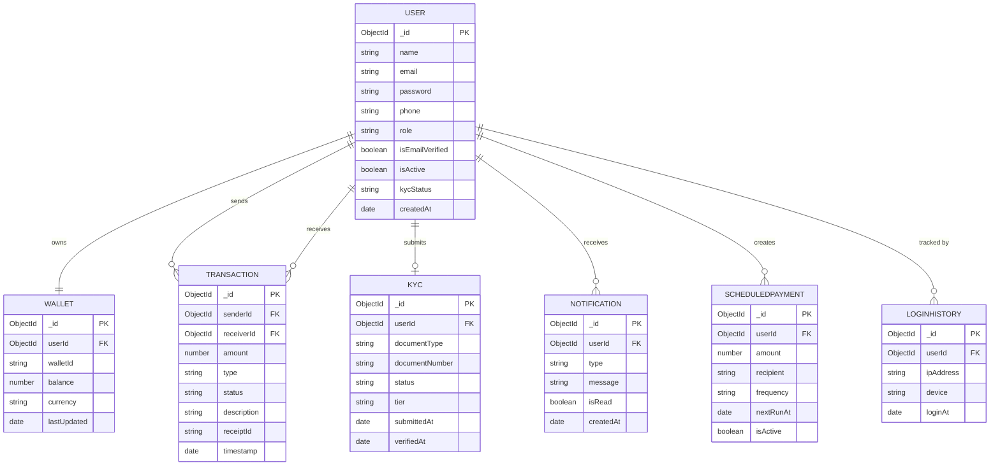

<div align="center">


<br/>


<br/>


<br/>

> ***⚡ A sleek, secure, and scalable fintech payment platform — built with precision for the modern web.***

<br/>

[](https://github.com/lucifers-0666/ZenoPay-V1)
[](https://github.com/lucifers-0666/ZenoPay-V1/issues)
[](https://github.com/lucifers-0666/ZenoPay-V1/issues)

</div>

---

## 📋 Table of Contents

- [About the Project](#-about-the-project)
- [Tech Stack](#-tech-stack)
- [System Architecture](#-system-architecture)
- [Database Schema](#-database-schema)
- [Features](#-features)
- [Project Structure](#-project-structure)
- [Getting Started](#-getting-started)
- [Environment Variables](#-environment-variables)
- [API Endpoints](#-api-endpoints)
- [Contributors](#-contributors--commit-stats)
- [Roadmap](#-roadmap)
- [License](#-license)

---

## 🧩 About the Project

**ZenoPay** is a full-stack fintech payment platform that simplifies digital transactions with a clean admin panel, secure session-based authentication, real-time notification polling, KYC verification flow, and a wallet system built for Indian payment workflows (UPI, QR, P2P).

### ✨ Key Highlights

- 💳 P2P wallet transfers with PIN-verified payment flow and confetti success screen
- 🔐 Session-based auth with OTP email verification + forgot password flow
- 📊 Admin dashboard with full user and transaction control
- 🔔 Real-time notification polling every 25 seconds
- 🪪 Multi-tier KYC verification with document upload
- 🗓️ Scheduled payments runner service with cron support
- 🔒 CSRF protection, separate admin/user session isolation
- 📱 Fully responsive — mobile bottom nav + desktop sidebar
- 🌐 Clean MVC architecture: Node.js + Express + MongoDB + EJS

---

## 🛠️ Tech Stack

<table>
  <tr>
    <td valign="top"><b>🌐 Frontend</b></td>
    <td>
      
      
      
      
    </td>
  </tr>
  <tr>
    <td valign="top"><b>⚙️ Backend</b></td>
    <td>
      
      
    </td>
  </tr>
  <tr>
    <td valign="top"><b>🗄️ Database</b></td>
    <td>
      
      
    </td>
  </tr>
  <tr>
    <td valign="top"><b>🔐 Auth & Security</b></td>
    <td>
      
      
      
      
    </td>
  </tr>
  <tr>
    <td valign="top"><b>🔧 Tools</b></td>
    <td>
      
      
      
      
      
    </td>
  </tr>
</table>

---

## 🏗️ System Architecture

### Application Flowchart



---

### 💳 Payment Flow — Sequence Diagram



---

### 🔔 Notification Polling Flow



---

## 🗃️ Database Schema



---

## 🚀 Features

| Feature | Description | Added By | Status |
|---------|-------------|----------|--------|
| 🔐 Session Auth | Login/register with session cookie + bcrypt | @lucifers-0666 | ✅ Done |
| 📧 OTP Verification | Email OTP for registration & login | @lucifers-0666 | ✅ Done |
| 💳 P2P Payments | Wallet-to-wallet with PIN confirm + confetti | @lucifers-0666 | ✅ Done |
| 💰 Wallet System | Top-up, withdraw, real-time balance | @lucifers-0666 | ✅ Done |
| 🔔 Live Notifications | Polling every 25s, mark-all-read API | @lucifers-0666 | ✅ Done |
| 🪪 KYC Flow | Multi-step doc upload, tier-based limits | @lucifers-0666 | ✅ Done |
| 🔒 Transaction PIN | bcrypt-hashed 4-digit PIN + lockout | @lucifers-0666 | ✅ Done |
| 🛡️ Admin Dashboard | User control, analytics, audit log | @lucifers-0666 | ✅ Done |
| 🗓️ Scheduled Payments | Cron-based recurring payment runner | @lucifers-0666 | ✅ Done |
| 📱 Mobile UI | Bottom nav, responsive across all screens | @lucifers-0666 | ✅ Done |
| 🔑 CSRF Protection | All POST routes csrf-protected | @lucifers-0666 | ✅ Done |
| 📤 Session Isolation | Separate admin/user sessions, no conflict | @lucifers-0666 | ✅ Done |
| 📊 Report Export | CSV download of transactions | — | 🚧 In Progress |
| 🌍 Multi-currency | INR, USD, and other currencies | — | 🔜 Planned |
| 🔑 2FA | TOTP-based two-factor authentication | — | 🔜 Planned |

---

## 📁 Project Structure

```
📦 ZenoPay-V1/
│
├── 📁 public/                      # Static assets
│   ├── 📁 css/                     # Per-page stylesheets
│   │   ├── dashboard.css
│   │   ├── auth.css
│   │   ├── kyc-verification.css
│   │   └── ...
│   ├── 📁 js/                      # Client-side scripts
│   └── 📁 images/                  # Icons, logos, SVGs
│
├── 📁 routes/                      # Express route files
│   ├── auth.routes.js
│   ├── user.routes.js
│   ├── transaction.routes.js
│   ├── admin.routes.js
│   └── notification.routes.js
│
├── 📁 controllers/                 # Business logic
│   ├── AuthController.js
│   ├── DashboardController.js
│   ├── TransactionController.js
│   ├── WalletController.js
│   ├── KYCController.js
│   ├── NotificationController.js
│   ├── AdminAuthController.js
│   └── ScheduledPaymentController.js
│
├── 📁 models/                      # Mongoose schemas
│   ├── User.js
│   ├── Wallet.js
│   ├── Transaction.js
│   ├── KYC.js
│   ├── Notification.js
│   ├── ScheduledPayment.js
│   ├── LoginHistory.js
│   └── PaymentGatewaySettings.js
│
├── 📁 views/                       # EJS templates
│   ├── 📁 partials/                # header.ejs, footer.ejs
│   ├── 📁 auth/                    # login, register, OTP, forgot-password
│   ├── 📁 dashboard/               # main dashboard, wallet, transactions
│   ├── 📁 admin/                   # admin panel views
│   ├── 📁 kyc/                     # kyc-submit, kyc-status, limits
│   └── 📁 user/                    # profile, settings, scheduled-payments
│
├── 📁 middleware/
│   ├── auth.middleware.js          # User session guard
│   ├── admin.middleware.js         # Admin session guard
│   └── pin.middleware.js           # PIN verification enforcer
│
├── 📁 services/
│   ├── EmailService.js             # OTP, welcome, password reset emails
│   └── ScheduledPaymentsRunner.js  # Cron job service
│
├── 📁 config/
│   └── db.js                       # MongoDB connection
│
├── 📄 .env.example
├── 📄 .gitignore
├── 📄 package.json
└── 📄 server.js                    # Entry point
```

---

## ⚙️ Getting Started

### Prerequisites

- 
- 
- 

### Installation

1. **Clone the repository**
   ```bash
   git clone https://github.com/lucifers-0666/ZenoPay-V1.git
   cd ZenoPay-V1
   ```

2. **Install dependencies**
   ```bash
   npm install
   ```

3. **Configure environment variables**
   ```bash
   cp .env.example .env
   # Edit .env with your values
   ```

4. **Create admin user**
   ```bash
   npm run create-admin
   ```

5. **Start development server**
   ```bash
   npm run dev
   ```

6. **Visit in browser**
   ```
   http://localhost:3000        → Public/User app
   http://localhost:3000/admin  → Admin panel
   ```

---

## 🔑 Environment Variables

| Variable | Description | Example |
|----------|-------------|---------|
| `PORT` | Server port | `3000` |
| `MONGO_URI` | MongoDB connection string | `mongodb://localhost:27017/zenopay` |
| `SESSION_SECRET` | Express session secret key | `your_super_secret` |
| `SESSION_EXPIRE` | Session max age (ms) | `86400000` |
| `EMAIL_HOST` | SMTP host for emails | `smtp.gmail.com` |
| `EMAIL_USER` | SMTP email address | `noreply@zenopay.com` |
| `EMAIL_PASS` | SMTP email password | `app_password_here` |
| `ADMIN_EMAIL` | Default admin email | `admin@zenopay.com` |
| `ADMIN_PASSWORD` | Default admin password | `Admin@123` |
| `NODE_ENV` | Environment mode | `development` |

> ⚠️ **Never commit `.env`** — use `.env.example` as reference only.

---

## 📡 API Endpoints

### Auth
| Method | Endpoint | Description |
|--------|----------|-------------|
| `GET` | `/login` | Login page |
| `POST` | `/login` | Authenticate user |
| `POST` | `/register` | Register new user |
| `POST` | `/verify-otp` | Verify email OTP |
| `POST` | `/forgot-password` | Send reset OTP |
| `POST` | `/logout` | Destroy session |

### Transactions & Wallet
| Method | Endpoint | Description |
|--------|----------|-------------|
| `GET` | `/dashboard` | User dashboard |
| `POST` | `/transactions/send` | P2P money transfer |
| `GET` | `/transactions/history` | Paginated history |
| `GET` | `/transactions/history/data` | JSON transaction data |
| `POST` | `/wallet/topup` | Add money to wallet |
| `POST` | `/wallet/withdraw` | Withdraw to bank |

### Notifications
| Method | Endpoint | Description |
|--------|----------|-------------|
| `GET` | `/notifications` | Get all notifications |
| `POST` | `/notifications/read-all` | Mark all as read |

### Admin
| Method | Endpoint | Description |
|--------|----------|-------------|
| `GET` | `/admin/dashboard` | Admin overview |
| `GET` | `/admin/users` | All users list |
| `PATCH` | `/admin/users/:id/block` | Block/unblock user |
| `GET` | `/admin/transactions` | All transactions |

---

## 👥 Contributors & Commit Stats

<div align="center">

### 🏆 Top Contributors

<table>
  <tr>
    <td align="center" width="220px">
      <a href="https://github.com/lucifers-0666">
        <br/>
        <b>lucifers-0666</b>
      </a><br/><br/>
      
      <br/><br/>
      <sub><b>100+ commits · Core Platform</b></sub><br/>
      <sub>Auth · Wallet · KYC · Admin · UI/UX</sub><br/>
      <sub>Notification System · Cron Runner</sub>
    </td>
    <td align="center" width="220px">
      <!-- ⚠️ Replace CONTRIBUTOR_USERNAME and CONTRIBUTOR_NAME below -->
      <a href="https://github.com/CONTRIBUTOR_USERNAME">
        <br/>
        <b>CONTRIBUTOR_NAME</b>
      </a><br/><br/>
      
      <br/><br/>
      <sub><b>X commits · [Feature Area]</b></sub><br/>
      <sub>[What they built]</sub>
    </td>
  </tr>
</table>

---

### 📊 Commit Activity

```
📌 Contribution Breakdown (100+ commits scanned):

  lucifers-0666    ████████████████████████████████  100+ commits  🏆 Most Commits
                   Core Auth · Wallet Engine · KYC Flow
                   Admin Panel · Notification Polling
                   Session Security · Cron Runner · UI Design

  [Contributor 2]  ████████                           X commits
                   [Feature they worked on]
```

---

### 🔬 Who Built What

| Contributor | Feature | Area |
|-------------|---------|------|
| [@lucifers-0666](https://github.com/lucifers-0666) 👑 | P2P Wallet + Transaction PIN System | Backend + Frontend |
| [@lucifers-0666](https://github.com/lucifers-0666) | OTP Email Verification + Session Isolation | Security |
| [@lucifers-0666](https://github.com/lucifers-0666) | Multi-Tier KYC Flow + Limits Page | Compliance |
| [@lucifers-0666](https://github.com/lucifers-0666) | Real-time Notification Polling (25s) | Real-time |
| [@lucifers-0666](https://github.com/lucifers-0666) | Admin Panel + Dashboard Redesign | Admin |
| [@lucifers-0666](https://github.com/lucifers-0666) | Scheduled Payments Cron Runner | Automation |
| [@lucifers-0666](https://github.com/lucifers-0666) | ZenoPay Brand Design System | UI/UX |
| @CONTRIBUTOR_USERNAME | [Their unique feature] | [Area] |

---

### 🌐 Live Contributor Graph

[](https://github.com/lucifers-0666/ZenoPay-V1/graphs/contributors)

</div>

---

## 🗺️ Roadmap

- [x] Session-based auth with OTP email verification
- [x] P2P wallet transfer with transaction PIN
- [x] KYC multi-step verification flow
- [x] Real-time notification polling
- [x] Scheduled payments cron service
- [x] Admin panel with user & transaction management
- [x] CSRF protection + session isolation
- [x] Mobile responsive with bottom nav
- [ ] CSV/PDF export for transaction reports
- [ ] Razorpay / Stripe payment gateway integration
- [ ] Multi-currency support (INR, USD)
- [ ] TOTP two-factor authentication (2FA)
- [ ] Real-time transactions with Socket.io
- [ ] Mobile app (React Native / Kotlin)

---

## 📄 License

Distributed under the **MIT License**.

```
MIT License — Copyright (c) 2026 lucifer's lab (lucifers-0666)
```

---

<div align="center">


**⭐ If ZenoPay helped you, give it a star!**

[](https://github.com/lucifers-0666)

</div>
