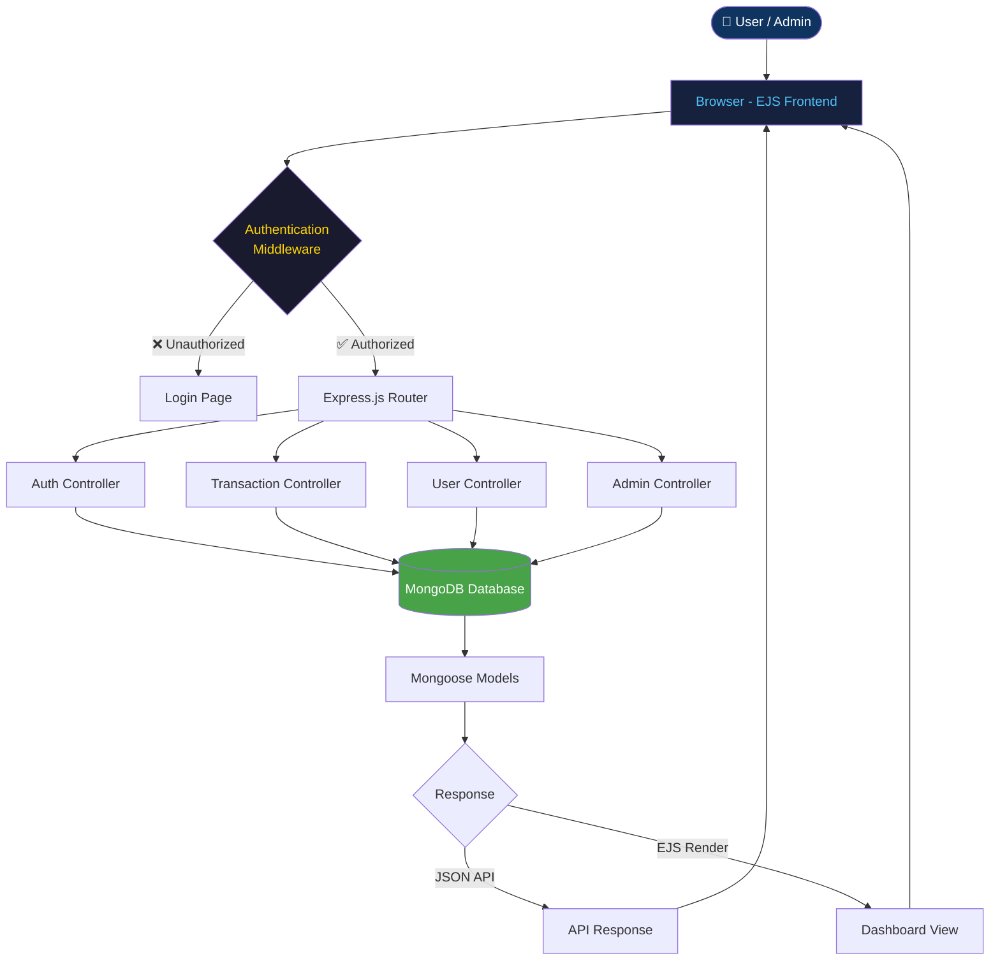
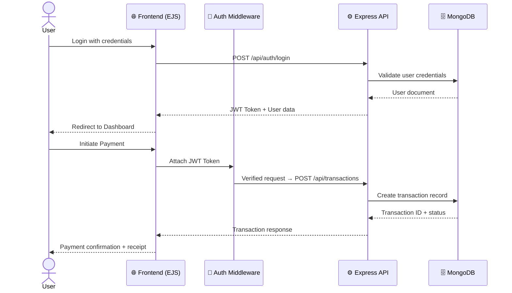
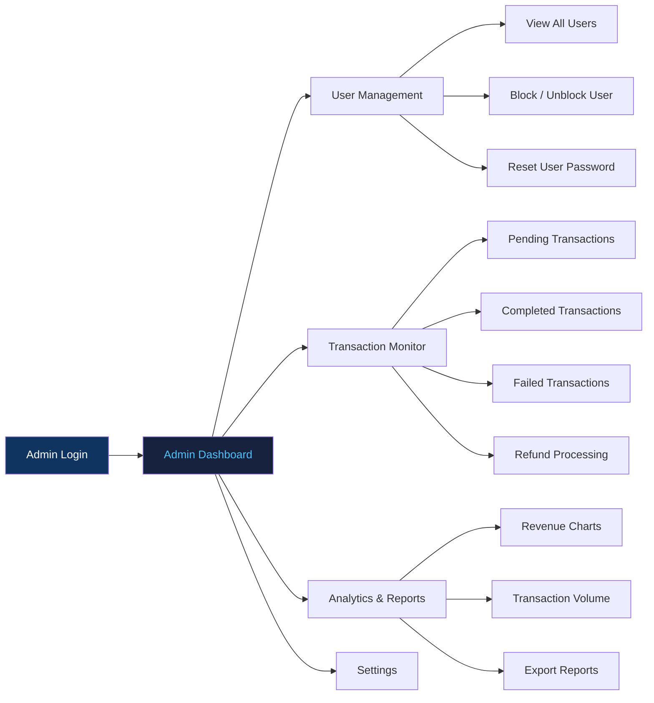
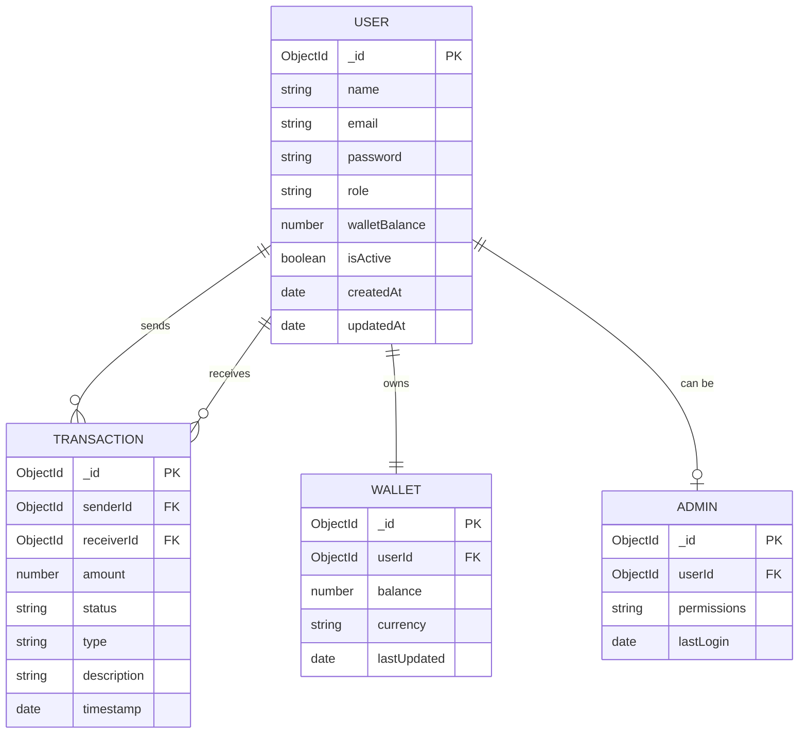

<div align="center">

<!-- LOGO / BANNER -->


<br/>

<!-- TECH BADGES -->


<br/>

<!-- STATUS BADGES -->


<br/>

> ***⚡ A sleek, secure, and scalable fintech payment platform built for the modern web.***

<br/>

[
[
[

</div>

***

## 📋 Table of Contents

- [About the Project](#-about-the-project)
- [Screenshots](#-screenshots)
- [Tech Stack](#-tech-stack)
- [System Architecture](#-system-architecture)
- [Database Schema](#-database-schema)
- [Features](#-features)
- [Project Structure](#-project-structure)
- [Getting Started](#-getting-started)
- [Environment Variables](#-environment-variables)
- [API Endpoints](#-api-endpoints)
- [Contributors](#-contributors)
- [Roadmap](#-roadmap)
- [License](#-license)

***

## 🧩 About the Project

**ZenoPay** is a full-stack fintech payment platform that simplifies digital transactions with a clean admin panel, secure authentication, and real-time transaction management. Built to handle payments, user wallets, and financial reporting — all from a beautiful, responsive dashboard.

### ✨ Key Highlights

- 💳 Seamless payment flow with real-time status updates
- 🔐 JWT-based secure authentication system
- 📊 Admin dashboard with live transaction analytics
- 👤 User wallet management with balance tracking
- 📱 Fully responsive — works on all devices
- 🌐 RESTful API architecture with clean MVC structure

***

## 📸 Screenshots

> Add your screenshots in the `assets/screenshots/` folder

| Dashboard | Transactions | User Panel |
|-----------|-------------|------------|
|  |  |  |

***

## 🛠️ Tech Stack

<table>
  <tr>
    <td><b>🌐 Frontend</b></td>
    <td>
      
      
      
      
    </td>
  </tr>
  <tr>
    <td><b>⚙️ Backend</b></td>
    <td>
      
      
    </td>
  </tr>
  <tr>
    <td><b>🗄️ Database</b></td>
    <td>
      
      
    </td>
  </tr>
  <tr>
    <td><b>🔧 Tools & DevOps</b></td>
    <td>
      
      
      
      
      
    </td>
  </tr>
  <tr>
    <td><b>🔐 Auth & Security</b></td>
    <td>
      
      
    </td>
  </tr>
</table>

***

## 🏗️ System Architecture

### Application Flow



***

### User Journey — Payment Flow



***

### Admin Dashboard Flow



***

## 🗃️ Database Schema



***

## 🚀 Features

| Feature | Description | Added By | Status |
|---------|-------------|----------|--------|
| 🔐 User Authentication | JWT-based login/register with bcrypt password hashing | @lucifers-0666 | ✅ Done |
| 💳 Payment Processing | Send & receive money between user wallets | @lucifers-0666 | ✅ Done |
| 📊 Admin Dashboard | Full admin panel with user and transaction control | @lucifers-0666 | ✅ Done |
| 👤 User Management | View, block/unblock users from admin panel | @lucifers-0666 | ✅ Done |
| 📈 Transaction History | Paginated transaction logs with filter/search | @lucifers-0666 | ✅ Done |
| 💰 Wallet System | Per-user balance tracking and management | @lucifers-0666 | ✅ Done |
| 📱 Responsive UI | Mobile-first design for all screen sizes | @lucifers-0666 | ✅ Done |
| 📤 Report Export | Download transaction reports as CSV | — | 🚧 In Progress |
| 🔔 Notifications | Real-time alerts for payment events | — | 🔜 Planned |
| 🌍 Multi-currency | Support for INR, USD and other currencies | — | 🔜 Planned |

***

## 📁 Project Structure

```
📦 ZenoPay-V1/
│
├── 📁 public/                  # Static assets
│   ├── 📁 css/                 # Stylesheets
│   ├── 📁 js/                  # Client-side scripts
│   └── 📁 images/              # Images & icons
│
├── 📁 routes/                  # Express route handlers
│   ├── 📄 auth.routes.js       # Authentication routes
│   ├── 📄 user.routes.js       # User management routes
│   ├── 📄 transaction.routes.js # Payment/transaction routes
│   └── 📄 admin.routes.js      # Admin panel routes
│
├── 📁 controllers/             # Business logic
│   ├── 📄 auth.controller.js
│   ├── 📄 user.controller.js
│   ├── 📄 transaction.controller.js
│   └── 📄 admin.controller.js
│
├── 📁 models/                  # Mongoose schemas
│   ├── 📄 User.model.js
│   ├── 📄 Transaction.model.js
│   └── 📄 Wallet.model.js
│
├── 📁 views/                   # EJS templates
│   ├── 📁 layouts/             # Layout templates
│   ├── 📁 partials/            # Reusable components
│   ├── 📁 auth/                # Login / Register pages
│   ├── 📁 dashboard/           # Dashboard views
│   └── 📁 admin/               # Admin panel views
│
├── 📁 middleware/              # Custom middleware
│   ├── 📄 auth.middleware.js   # JWT verification
│   └── 📄 admin.middleware.js  # Admin role check
│
├── 📁 config/                  # Configuration files
│   └── 📄 db.js                # MongoDB connection
│
├── 📄 .env                     # Environment variables (not committed)
├── 📄 .env.example             # Environment variable template
├── 📄 .gitignore
├── 📄 package.json
└── 📄 server.js                # Entry point
```

***

## ⚙️ Getting Started

### Prerequisites

Make sure you have the following installed:

- 
- 
- 

### Installation

1. **Clone the repository**
   ```bash
   git clone https://github.com/lucifers-0666/ZenoPay-V1.git
   cd ZenoPay-V1
   ```

2. **Install dependencies**
   ```bash
   npm install
   ```

3. **Set up environment variables**
   ```bash
   cp .env.example .env
   # Edit .env with your values (see Environment Variables section below)
   ```

4. **Start MongoDB** (if running locally)
   ```bash
   mongod
   ```

5. **Run the development server**
   ```bash
   npm run dev
   ```

6. **Open in browser**
   ```
   http://localhost:3000
   ```

***

## 🔑 Environment Variables

Create a `.env` file in the root directory. Reference `.env.example`:

| Variable | Description | Example |
|----------|-------------|---------|
| `PORT` | Server port number | `3000` |
| `MONGO_URI` | MongoDB connection string | `mongodb://localhost:27017/zenopay` |
| `JWT_SECRET` | Secret key for JWT signing | `your_super_secret_key` |
| `JWT_EXPIRE` | JWT token expiry duration | `7d` |
| `ADMIN_EMAIL` | Default admin email | `admin@zenopay.com` |
| `ADMIN_PASSWORD` | Default admin password | `Admin@123` |
| `NODE_ENV` | Environment mode | `development` |

> ⚠️ **Never commit your `.env` file.** Always use `.env.example` as the template.

***

## 📡 API Endpoints

### Authentication
| Method | Endpoint | Description |
|--------|----------|-------------|
| `POST` | `/api/auth/register` | Register a new user |
| `POST` | `/api/auth/login` | Login and get JWT token |
| `POST` | `/api/auth/logout` | Logout user |

### Transactions
| Method | Endpoint | Description |
|--------|----------|-------------|
| `GET` | `/api/transactions` | Get all transactions (paginated) |
| `POST` | `/api/transactions/send` | Initiate a payment |
| `GET` | `/api/transactions/:id` | Get single transaction |

### Admin
| Method | Endpoint | Description |
|--------|----------|-------------|
| `GET` | `/api/admin/users` | Get all users |
| `PATCH` | `/api/admin/users/:id/block` | Block/unblock a user |
| `GET` | `/api/admin/analytics` | Get dashboard analytics |

***

## 👥 Contributors

<div align="center">

### 🏆 Who Built What

| Contributor | Role | Unique Features Built |
|-------------|------|-----------------------|
| [@lucifers-0666](https://github.com/lucifers-0666) | 🧑‍💻 Lead Developer | Payment Engine, Auth System, Admin Panel, UI/UX Design |

***

### 📊 Contribution Stats

```
📌 Commit Activity:

@lucifers-0666  ████████████████████████████  Core Platform
```

***

### 🤝 Contributor Card

<table>
  <tr>
    <td align="center">
      <a href="https://github.com/lucifers-0666">
        <br/>
        <b>lucifers-0666</b>
      </a><br/>
      <sub>🔧 Lead Developer</sub><br/>
      <sub>⭐ Payment System · Auth · Admin Panel</sub>
    </td>
    <!-- Add more contributors here as the project grows -->
  </tr>
</table>

***

### 🌐 Live Contributors Graph

[

</div>

***

## 🗺️ Roadmap

- [x] User authentication (JWT + bcrypt)
- [x] Wallet system with balance management
- [x] Admin dashboard with user control
- [x] Transaction history with filters
- [x] Responsive UI design
- [ ] Real-time notifications (Socket.io)
- [ ] CSV/PDF report export
- [ ] Payment gateway integration (Razorpay / Stripe)
- [ ] Multi-currency support
- [ ] Two-factor authentication (2FA)
- [ ] Mobile app (React Native / Kotlin)

***

## 📄 License

Distributed under the **MIT License**. See [`LICENSE`](./LICENSE) for more information.

```
MIT License — Copyright (c) 2025 lucifers-0666
Permission is hereby granted, free of charge, to any person obtaining a copy
of this software to use, copy, modify, merge, publish, distribute, sublicense...
```

***

<div align="center">


**⭐ Star this repo if you found it helpful!**

[

</div>
